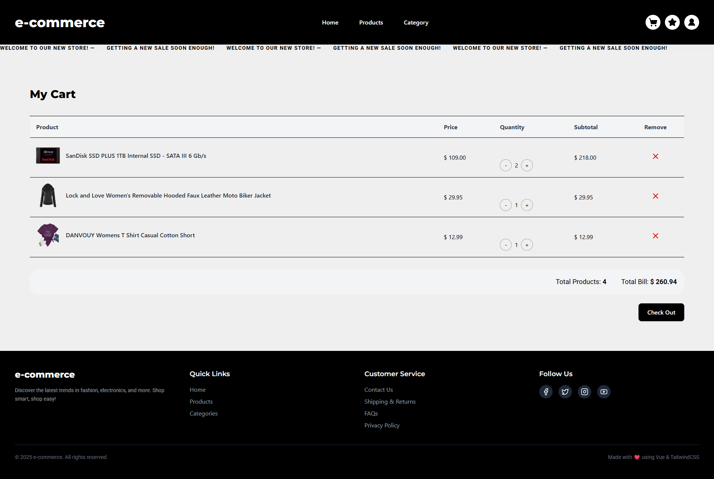
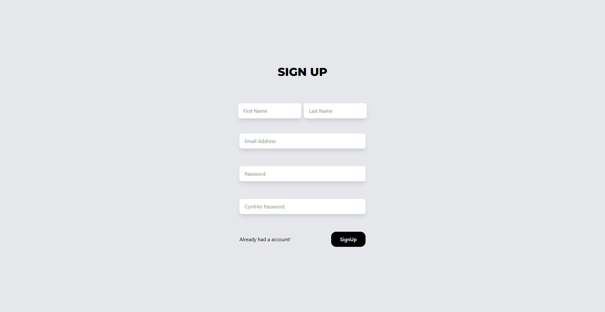
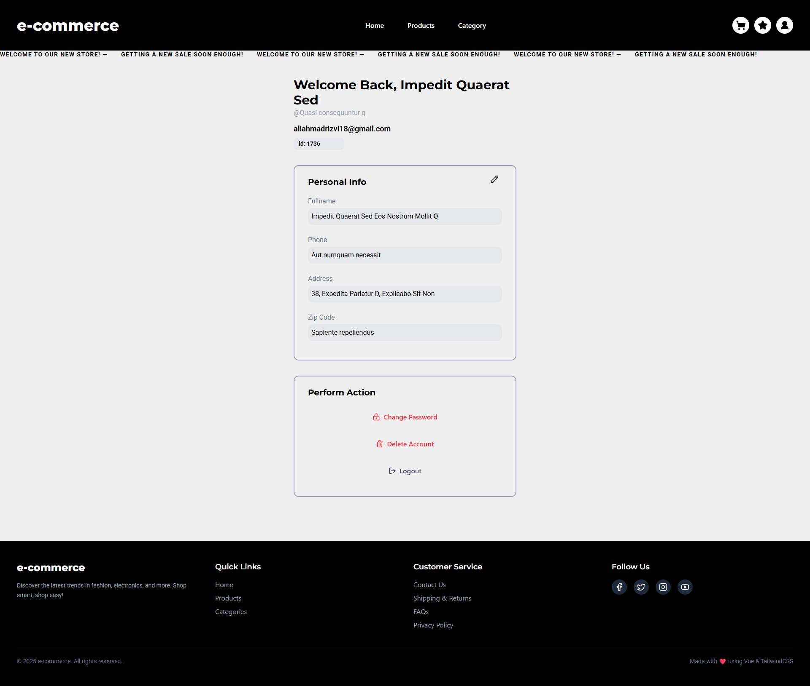

# E-Commerce Template (Client-Side)

A modern and responsive e-commerce frontend built with Vue 3, Pinia, Tailwind CSS, and Vue Toastification.

## Features

- Vue 3 Composition API architecture
- Pinia state management for products, cart, favorites, auth, and admin
- Vue Router based navigation
- Local mock API with `json-server`
- Responsive UI for desktop and mobile

## Tech Stack

- Vue 3
- Pinia
- Vue Router
- Tailwind CSS
- Axios
- json-server

## Installation and Setup

1. Clone the repository:

```bash
git clone https://github.com/your-username/your-ecommerce-template.git
cd your-ecommerce-template
```

2. Install dependencies:

```bash
npm install
```

3. Run frontend:

```bash
npm run dev
```

4. Run local API:

```bash
npm run api
```

By default, the app uses `http://localhost:3004` if `VITE_LOCAL_API_URL` is not set.

## Environment Variables

Create a `.env` file (optional):

```bash
VITE_LOCAL_API_URL=http://localhost:3004
```

## Build

```bash
npm run build
```

## Screenshots

### User Screens

#### Home Page


#### Product Page


#### Product Details


#### Cart



#### Sign In


#### Sign Up



#### User Profile



### Admin Screens

#### Admin Login


#### Admin Dashboard


#### Manage Product


#### Manage Orders


#### Manage Users


#### Manage Admin


#### Admin Profile


## Author

Ali Ahmad  
Front-End Developer | Vue.js | React.js | Tailwind CSS
